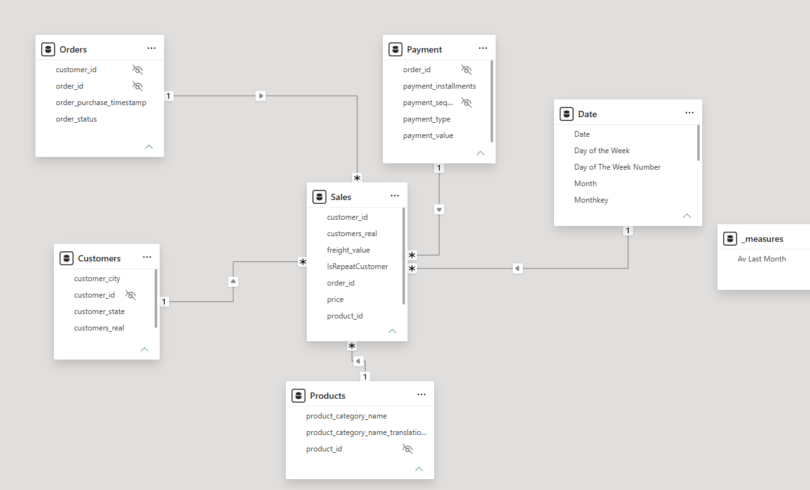
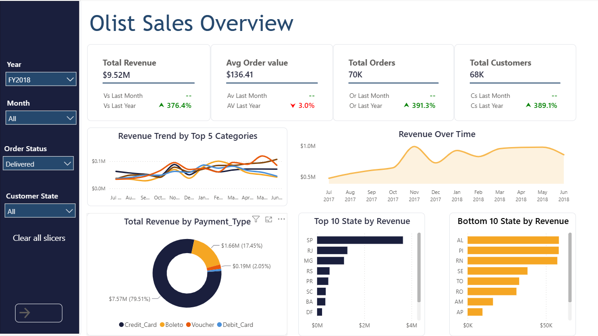
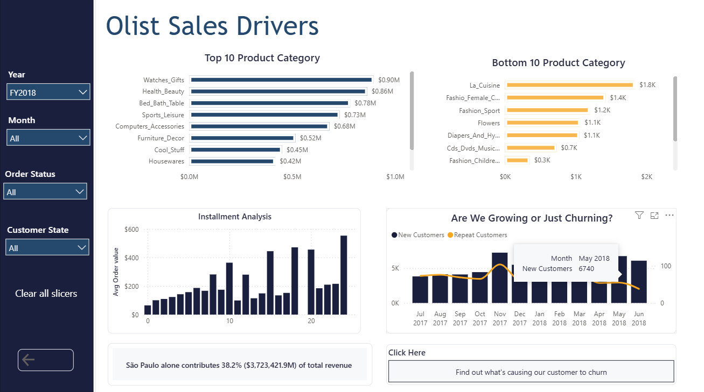
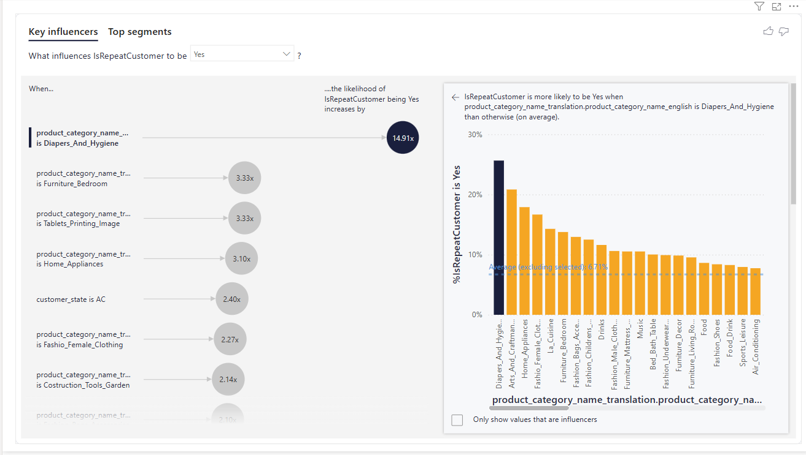
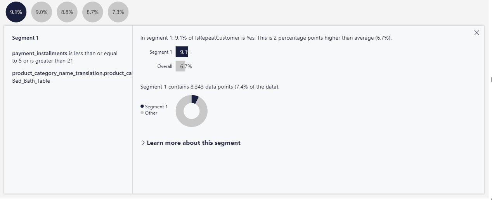

# Olist Brazilian E-Commerce | Sales & Customer Retention Analysis

A Power BI dashboard built on the Olist Brazilian e-commerce dataset, designed to answer one question: **what's driving Olist's revenue, and why aren't customers coming back?**

---

## The dataset

**Source:** [Brazilian E-Commerce Public Dataset by Olist — Kaggle](https://www.kaggle.com/datasets/olistbr/brazilian-ecommerce)

Olist is Brazil's largest department store on marketplaces, and they released this dataset publicly covering 100K+ real orders placed between 2016 and 2018 across multiple marketplaces in Brazil.

**Shape of the data:**
- **9 CSV files** covering orders, order items, customers, products, payments, reviews, sellers, geolocation, and product category translations
- **52 columns** in total across all tables — 13 strings, 13 integers, 12 UUIDs, and 14 other types (dates, decimals, booleans)
- Records span roughly 24 months of e-commerce activity in Brazil

The relational structure across 9 files is what makes this dataset good for a real BI project — it forces you to build a proper star schema instead of working from one flat table.

---

## The business problem

Olist is Brazil's largest marketplace connecting small merchants to major online stores. On paper the numbers look healthy: $13.59M in revenue, 99K orders, 96K customers.

But dig in and one number stops you cold: **only 6.7% of customers ever come back for a second purchase**. That's the real story. Olist doesn't have an acquisition problem, it has a memory problem — 93% of buyers try it once and disappear.

I built this dashboard to figure out three things: where the revenue is actually coming from, what's driving (or blocking) repeat purchases, and where a stakeholder should spend the next dollar of marketing budget.

---

## How I approached the data

Before any visual went on the canvas, I spent time getting the model right. This part matters more than the charts.

**Table selection.** The Olist dataset ships with 9 CSV files. I only pulled in the ones that answered business questions: orders, order_items, customers, products, payments, order_reviews, and the product category translation. Sellers and geolocation tables went unused — they didn't add to the story I wanted to tell.

**Handling nulls.** Product categories had a chunk of nulls. Rather than drop those rows (and lose revenue), I replaced them with "Unspecified" in Power Query so they still show up in totals but flag themselves as data-quality gaps.

**Date table.** I built a Date table in DAX assuming the business follows a **July 1 fiscal year start**, which is common in many markets and gave me clean fiscal quarters to work with. It includes fiscal year, fiscal month number (for correct chart sorting), fiscal quarter, and calendar equivalents. I marked it as the date table so all time intelligence functions work properly.

**Star schema.** Customers, Products, Payments, and Date became dimension tables. Sales became my fact table. To make Total Customers and Total Orders respond to the date slicer, I merged the customer key from Orders into Sales as a calculated column using RELATED. Without that step, my customer counts sat frozen no matter what year the user picked.

**The weird gap in the data.** During analysis I noticed several months across the dataset had zero or unusually low sales recorded. Not just soft months, actually zero in some cases. This is a known quirk of the Olist dataset where data collection was inconsistent at the edges of the timeline, and left alone it made time-series comparisons misleading — the dashboard would show revenue crashing to nothing in those months and skew every trend line.

For the zero and near-zero months, I chose to keep them in the visuals rather than filter them out. The reason: excluding them created odd jumps in the trend lines and made the story harder to read visually. Keeping them in produces a smoother-looking trend for the stakeholder's eye, but it's important to flag this as a **known data quality issue** — anyone reading the dashboard should know those flat patches at the edges of the timeline are collection gaps, not real business collapses.

---

## The DAX that drives the story

A few measures did the heavy lifting:

- **Total Revenue, Total Orders, Total Customers** — the base measures using SUM and DISTINCTCOUNT off the fact table
- **Vs Last Month & Vs Last Year** — YoY and MoM percentage change measures with UNICHAR arrows (▲▼) embedded in the text, so the KPI cards read like "▲ 366.4%" without needing separate icon logic
- **HASONEVALUE guards** — wrapped around every time comparison, so "Vs Last Month" only shows when a single month is actually selected. Otherwise it returns blank. Prevents the classic Power BI mistake of showing garbage numbers when the user has "All" selected
- **Conditional formatting measures** — return "Green", "Red", or "Grey" as text based on the sign of the change, then plugged into the reference label color via field-value formatting

---

## What the dashboard shows

Three pages, each answering a specific question.

### Page 1 — Sales Overview: "How are we doing?"

- 4 KPI cards with YoY and MoM deltas
- Revenue over time
- Top 10 and Bottom 10 states by revenue (São Paulo dominates)
- Revenue split by payment type (credit card = 79.5%)

### Page 2 — Sales Drivers: "What's causing the numbers?"

- Top 10 and Bottom 10 product categories
- Revenue trend by top 5 categories over time
- New vs repeat customer trend
- Installment payment analysis

**Headline finding: São Paulo alone contributes 38.2% ($3.72M) of total revenue. Health & Beauty ($1.26M) and Watches & Gifts ($1.21M) lead category revenue. But high revenue ≠ high retention. Which is why Page 3 exists.**

### Page 3 — Key Drivers of Repeat Customers: "Why aren't they coming back?"

Used Power BI's Key Influencers AI visual to model what makes a customer likely to be a repeat buyer. The results genuinely surprised me — I went in expecting location and order value to matter most, and neither did.

**It's not location. It's not order size. It's category and payment behavior.**

**What the AI found (Key Influencers tab):**

Against a baseline repeat rate of 6.7%, these are the factors that push a customer's likelihood of returning the highest:

- **Diapers & Hygiene buyers → 14.9x more likely to repeat** (the single strongest signal in the whole dataset)
- **Bedroom Furniture → 3.3x**
- **Tablets, Printing & Image → 3.3x**
- **Home Appliances → 3.1x**
- **Customer state = Acre (AC) → 2.4x** (the only geographic signal, and a weak one)
- **Female Fashion → 2.3x**
- **Construction Tools & Garden → 2.1x**

Notice the pattern: five of the top seven influencers are home-and-household categories. The AI is quietly telling us that Olist's repeat customers are people furnishing homes and buying consumables — not tech shoppers, not gift buyers.

**What the AI found (Top Segments tab):**

The visual also grouped customers into five distinct segments that all beat the average repeat rate:

- **Segment 1 (9.1% repeat rate)** — Bed & Bath buyers using either short (≤5) or long (≥21) installment plans
- **Segment 2 (9.0%)** — São Paulo customers using mid-range installments (6–21)
- **Segment 3 (8.8%, the largest segment)** — Non-São Paulo customers using mid-range installments — 11% of the whole customer base
- **Segment 4 (8.7%)** — Furniture & Decor buyers, short or long installments
- **Segment 5 (7.3%)** — Sports & Leisure buyers, short or long installments

Together, these five segments cover roughly 37% of Olist's customer base and all outperform the baseline.

**The takeaway:** retention isn't random. It clusters around two things — what category people buy (repeat-need items like hygiene, bed & bath, furniture, hobbies) and how they choose to pay (short-term confident buyers or long-term committed buyers, not the mid-range one-off shoppers). What's *not* on this list matters just as much: electronics, gifts, and gadgets show up in revenue totals but not in retention. They bring cash once and leave.

---

## What I'd recommend to Olist

**1. Launch a restock reminder flow for Diapers, Hygiene, and Bed & Bath categories.** These are the highest-signal categories in the entire dataset — Diapers & Hygiene buyers alone are 14.9x more likely to return. A simple 60–90 day "time to restock?" email would compound a signal the data is already showing organically. This is the single highest-ROI move on the list.

**2. Build a "furnishing your home" cross-sell journey.** Bedroom Furniture, Home Appliances, Bed & Bath, and Furniture & Decor all cluster in the top segments. These customers aren't shopping five separate categories — they're on one journey, kitting out a home. Treat them that way: bedroom buyers should see bed & bath promos, decor buyers should see furniture, and so on. Right now Olist is probably marketing to them as five different personas.

**3. Reshape installment offers around the two ends, not the middle.** The Top Segments finding is subtle but powerful: customers using short (≤5) OR long (≥21) installments repeat more than customers using mid-range plans (6–20). Short installments signal confidence and frequency; long installments signal commitment to a big purchase they care about. Mid-range plans signal a one-off, price-sensitive buyer who churns. Marketing should push short-term perks to the confident buyers and generous long-term terms to the committed ones — and stop over-promoting the middle.

**4. Stop over-investing in geographic marketing.** Only Acre (AC) showed up as a geographic influencer, and only weakly (2.4x). São Paulo dominates revenue *volume* (38.2% of total) but SP customers don't repeat at higher rates than the rest of Brazil — they're just a bigger acquisition pool. Marketing budget should follow customer *behavior* (category preference, payment terms), not the map.

**5. Do the retention math.** With a 96K customer base, moving repeat rate from 6.7% to just 8% would mean roughly **19,000 additional repeat customers** — without spending a rupiah more on acquisition. Repeat customers cost nothing to reactivate compared to new ones. The categories, segments, and payment patterns above are the roadmap for how to get there.

---

## Tools used

Power BI Desktop | DAX | Power Query | Star schema modeling | Key Influencers AI visual | Drill-through

---

## Files in this repo

- `Olist_Dashboard.pbix` — the full report
- `/screenshots` — page-by-page images
- `/data` — source CSV files (from Kaggle)
- `data_model.png` — star schema diagram

---

*Built as part of my Power BI portfolio. Feedback welcome — [[LinkedIn](https://www.linkedin.com/in/farhad-uddin-6b30991b9/)] | [farhaduddin884@gmail.com](#)*

